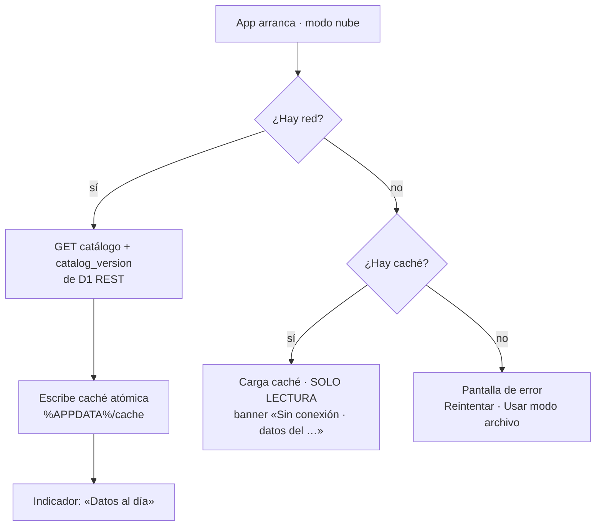
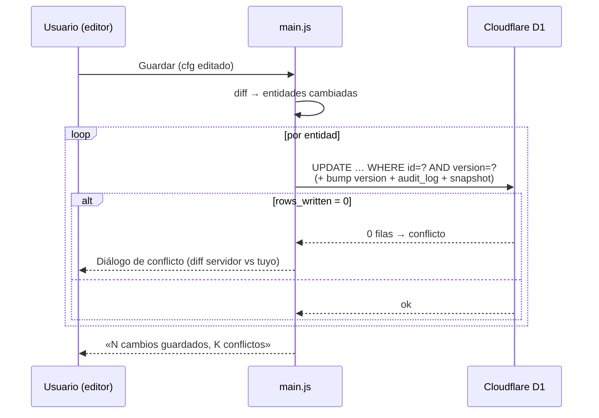
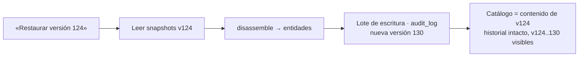

# 13 — La v5: nube sin servidor y producto (v5.0.0-beta)

> **Resumen ejecutivo:** la v5 deja **elegir dónde viven los datos** —archivo
> local/NAS o Cloudflare D1 en la cuenta de cada empresa, sin servidor del
> desarrollador— y convierte PackPrice en un **producto vendible**: asistente de
> primer arranque, edición sin contraseña con auditoría y vuelta atrás,
> presupuestos con cliente + estados + estadísticas, 6 plantillas de PDF y
> telemetría de errores opt-out. Al abrir la app, el usuario ve un indicador de
> «Datos al día» y una pantalla de estadísticas que antes no existía.

**Release:** `v5.0.0-beta` · **Fecha:** 2026-06-13 · **Tests:** 877 verdes ·
**Tamaño .exe:** ~85 MB (pendiente de medir en el build de release)

---

## Contexto

Hasta la v4, PackPrice era una calculadora excelente para **un** taller con
**un** `config.js` en su NAS. La v5 responde a tres necesidades que el v4 no
cubría (`docs/PRD.md` §3.2, R6–R20):

1. **Acceso fuera del taller y datos unificados de todos los PCs** — el archivo
   en el NAS no sale de la red local y cada PC ve solo su propio historial.
2. **Trazabilidad real** — quién cambió qué precio, y poder volver atrás.
3. **Venderlo a otras empresas sin montar infraestructura por cliente** — el
   principio rector (`docs/PRD.md` §1b): *el desarrollador no ve los datos de
   nadie; solo entrega software.*

La decisión de fondo, debatida y bloqueada en `CLAUDE.md` §2, fue radical:
**nube sí, servidor no**. La app habla directamente con la API REST de
Cloudflare D1 desde el main process, contra la **cuenta de cada empresa**, y se
aprovisiona la base de datos sola (estilo FactuSOL). Plan completo:
`planes/v5-cloud-sync.md`.

---

## Qué se hizo

En orden de lo que nota el usuario:

### 1. Elegir dónde viven los datos (Local o Nube)

Un **asistente de primer arranque** pregunta «¿Dónde guardamos tus datos?».
Local es el modo archivo de siempre (PC o NAS). Nube guía en 3 pasos: cuenta de
Cloudflare → crear el token con plantilla → pegarlo, y la app **busca o crea**
la base `packprice` sola. Local ↔ Nube son **intercambiables** desde ajustes en
cualquier momento.

<!-- TODO captura: asistente (datos demo) -->

### 2. Edición del catálogo sin contraseña

Desaparece la puerta de admin. La protección frente a errores son tres cosas
mejores que una contraseña compartida: **confirmación con resumen al guardar**,
**autor registrado** en cada escritura y **rollback** a cualquier versión.

<!-- TODO captura: confirmación de guardado -->

### 3. Auditoría, versiones y «Restaurar versión»

Cada guardado deja una fila de auditoría y un snapshot. Restaurar una versión
vieja crea una versión nueva (forward-only): nunca se pierde el rastro.

### 4. Presupuestos con cliente, estados, recordatorio y caché offline

Nombre y teléfono **obligatorios**, validez de 15 días en el PDF, chips de
estado (pendiente/aceptado/rechazado) y un **recordatorio discreto** al
arrancar. Sin conexión, los presupuestos se **encolan** y se suben al
reconectar; el catálogo se sirve de **caché** en solo lectura con su fecha.

<!-- TODO captura: indicador + banner offline -->

### 5. Estadísticas (SVG propio, modo nube)

Pantalla nueva con KPIs y gráficos sobre los datos de **todos** los PCs:
conversión, tramos, evolución, margen real vs objetivo, top de productos. Sin
librerías de gráficos: `renderer/charts.js` dibuja SVG a mano.

<!-- TODO captura: estadísticas -->

### 6. Plantillas de PDF

6 plantillas integradas (Clásica, Moderna, Compacta, Detallada, Corporativa,
Formulario) con vista previa y **color de marca** configurable; motor propio
estilo QWeb (`lib/template-engine.js`) y **plantillas personalizadas** como dato
compartido (saneadas: sin scripts ni recursos externos).

### 7. Producto: telemetría opt-out, diagnóstico y actualización

Informes de error **compatibles con Sentry** vía `fetch` propio (sin SDK), con
**lista blanca de campos** y un saneador con pruebas que jamás deja pasar datos
de negocio ni el token; **«Exportar diagnóstico»** para soporte a ciegas; y
comprobación de versión nueva contra **GitHub Releases** (sin auto-instalación,
desactivable).

---

## Cómo funciona

Tres piezas merecen un diagrama.

### Arranque en modo nube con caída a caché

La app **siempre** arranca, haya o no internet: si la red falla, sirve la caché
en solo lectura; sin caché ni red, una pantalla de error con salida a modo
archivo. Nunca datos inventados (`planes/v5-cloud-sync.md` §7).

### Escritura por entidad con guarda de versión

El editor trabaja sobre el `cfg` completo; `lib/diff.js` detecta qué entidades
cambiaron y solo esas se escriben, cada una con su guarda de versión. Si la
versión no coincide, conflicto **de esa entidad**, no del catálogo entero
(`planes/v5-cloud-sync.md` §4).

### Restauración forward-only

Restaurar nunca borra historial: lee el snapshot pedido y lo **vuelve a
escribir como versión nueva**, auditada.

---

## Caminos descartados

- **Un Worker de Cloudflare delante de la D1.** Era el diseño inicial del mismo
  día (2026-06-12): un Worker exponía una API REST propia y guardaba el secreto.
  Se **descartó horas después** a favor de hablar con **D1 directamente por su
  API REST oficial** desde el main process. Por qué ganó el acceso directo:
  - **Cero infraestructura por cliente.** Vender a otra empresa = entregar el
    `.exe`. Con Worker, cada empresa necesitaría un deploy y un dominio que
    alguien mantiene.
  - **No reabre la regla «sin backend».** Sin Worker no hay servidor del
    desarrollador que comprometer ni que pagar; el aislamiento entre empresas es
    total por construcción (cada una, su cuenta).
  - **El token es del cliente y solo toca su cuenta.** El main process ya es un
    entorno de confianza (igual que hoy lee el `config.js` del NAS); el renderer
    nunca ve la red ni el token (CSP intacta).
  - **Coste honesto asumido:** un lote REST de D1 no es una transacción
    interactiva. Se mitiga con guardas de versión autovalidantes, escrituras
    aditivas/idempotentes y el orden «dato primero, metadatos después». Para 2–3
    escrituras semanales de usuarios de confianza, sobra. Si algún día doliera,
    **el Worker es la costura** (`planes/v5-cloud-sync.md` §9.2), no una
    reescritura. La única ampliación que sí reintroduciría un Worker es un
    **portal web de cliente** (un navegador no puede llevar el token).
- **Librería de gráficos (Chart.js y similares).** Tres tipos de gráfico
  sencillos no justifican una dependencia (regla 9). Se dibujan en SVG a mano en
  `renderer/charts.js`.
- **SDK de telemetría.** El informe de error usa el **protocolo
  Sentry-compatible** por `fetch` propio: cero dependencias nuevas, y un
  saneador con pruebas controla exactamente qué sale.
- **Auto-instalación de actualizaciones (`electron-updater`).** Requiere
  infraestructura y firma. La v5 se queda en **avisar** con enlace a Releases;
  la actualización es reemplazar el `.exe` a mano.

---

## Decisiones bloqueadas

- **Decisión:** licencia **Apache-2.0**. **Por qué:** permisiva con concesión de
  patentes; el negocio es el **servicio**, no la licencia. **Reabrir solo si:**
  aparece un motivo legal de peso para cambiar de licencia.
- **Decisión:** **`.exe` sin firmar** por ahora. **Por qué:** el certificado no
  compensa para el uso actual; el manual documenta SmartScreen con capturas.
  **Reabrir solo si:** hay clientes de pago que lo exijan.
- **Decisión:** **semilla demo neutra (R16) = tarea de release del
  propietario**, no de la v5. **Por qué:** `config.default.js` es a la vez el
  catálogo real del taller (cliente nº 1) y el fixture que fija los importes
  exactos de los tests; neutralizarlo exige archivar antes el catálogo real en
  el NAS (operaciones), depende de la decisión D4 (qué números se publican) y
  re-fija toda la suite. **Reabrir solo si:** se abre el repo público — entonces
  se ejecuta como PR acotado (`docs/PRD.md` §4b.1, `planes/v5-impl-plan-7-producto.md` §0).
- **Decisión:** **informes de error opt-out** como excepción declarada a la
  regla de no-telemetría. **Por qué:** el desarrollador debe enterarse de un
  fallo antes que el cliente; **nunca** lleva datos de negocio (lista blanca +
  saneador probado), desactivable y documentado. **Reabrir solo si:** se quisiera
  enviar algo más que el error técnico (no se hará).
- **Pendiente del propietario:** confirmar el `owner/repo` real en `GITHUB_REPO`
  (`main.js`, hoy placeholder `xkoistudio/packprice`) y el titular del copyright
  en `LICENSE` antes de la primera release pública (`docs/PRD.md` §4b.1).

---

## Métricas de la release

| Métrica | Antes (v4) | Después (v5.0.0-beta) |
|---|---|---|
| Tests | ~813 | **877** verdes |
| Archivos de test | — | 44 |
| Módulos `lib/` | — | 33 (nuevos en v5: `d1-client`, `db-migrator`, `migration-loader`, `catalog-assembler`, `catalog-cache`, `catalog-writer`, `cloud-bootstrap`, `cloud-catalog`, `cloud-history`, `cloud-quotes`, `cloud-pdf-templates`, `quote-outbox`, `stats`, `template-engine`, `template-sanitizer`, `pdf-templates`, `diagnostics`, `error-reporter`, `error-scrubber`, `settings-privacy`, `version-compare`) |
| Módulos `renderer/` nuevos | — | `charts`, `data-status`, `quote-reminder`, `save-summary`, `stats-view`, `pdf-gallery` |
| Migraciones SQL empaquetadas | 0 | `db/migrations/0001_init.sql` |
| Dependencias nuevas | — | **0** (D1 vía `fetch` nativo; gráficos SVG; motor de plantillas propio) |
| Conexiones salientes fuera del almacén del cliente | 0 | 2, ambas desactivables: GitHub (versión) + informes de error (opt-out) |
| Tamaño del `.exe` | ~85 MB | ~85 MB (pendiente de medir) |

---

*Checklist antes de publicar: resumen de 3 líneas ✓ · capturas con datos de
demo (nunca precios reales) — **pendientes de generar** ⏳ · enlazado desde
`devlog/README.md` ✓ · publicar **antes** de distribuir el `.exe` ✓*
