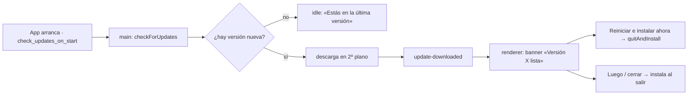
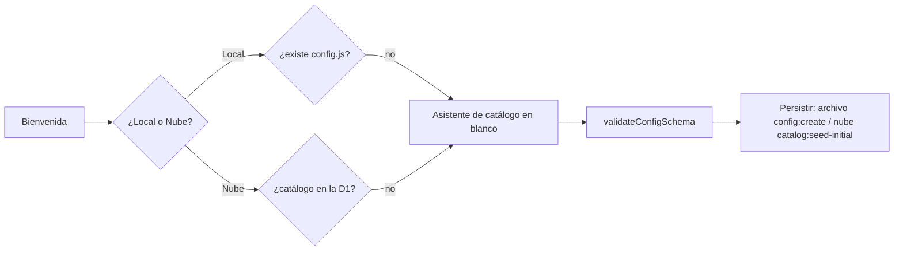

# 14 — Quanto se vuelve producto: marca, instalador y auto-update (v5.1.0-beta)

> **Resumen ejecutivo:** tras la v5.0.0-beta (motor de nube sin servidor), este
> tramo convierte Quanto en un **producto terminado de usar**: identidad de
> marca (PackPrice → **Quanto**), un **editor de catálogo** que un perfil no
> técnico navega de verdad (lista + búsqueda + editor enfocado, resúmenes de
> cambios en lenguaje llano), **primer arranque desde cero** (sin semilla de
> otra empresa), **instalador real** (NSIS per-user, arranque rápido) y
> **actualizaciones que se instalan solas** (electron-updater). Al abrir la app
> el usuario ve el nombre y el logo de Quanto; al editar, frases legibles en vez
> de claves; y a partir de ahora, las nuevas versiones llegan sin descargar
> nada a mano.

**Release:** `v5.1.0-beta` · **Fecha:** 2026-06-24 · **Tests:** 934 verdes
(al cierre de este tramo) · **Tamaño .exe:** ~85 MB (instalador NSIS;
pendiente de medir en el build de release)

> Nota de versión: la `v5.1.0-beta` publicada empaqueta este capítulo junto con
> el **15** (presupuestos compartidos) y el **16** (PDF con desglose sin IVA), y
> sale con **1143 tests verdes**. El smoke en la app empaquetada y la
> publicación de la primera release con `build:win-publish` siguen pendientes —
> ver *Qué falta*.

---

## Contexto

La v5.0.0-beta entregó el **motor**: datos en local o en Cloudflare D1 (en la
cuenta de cada empresa, sin servidor del desarrollador), auditoría, rollback,
presupuestos, estadísticas y plantillas de PDF (`devlog/13-v5-cloud-y-producto`).
Era potente, pero todavía se *notaba* a medio terminar como producto vendible:

1. **Sin identidad.** Se llamaba PackPrice y no tenía marca propia.
2. **El editor de catálogo era denso.** Todo en un modal largo; encontrar un
   producto entre muchos costaba, y los cambios se mostraban con claves técnicas
   (`extra_cost_3xl`) en vez de en lenguaje de taller.
3. **Una instalación nueva traía los números de otra empresa.** El primer
   arranque sembraba el catálogo del cliente nº 1 (`buildDefaultConfig`).
4. **El `.exe` portable arrancaba lento** (se autoextraía ~85 MB a `%TEMP%` en
   cada inicio) y no permitía auto-actualización.
5. **Las actualizaciones eran manuales:** la app avisaba de versión nueva, pero
   el usuario tenía que ir a GitHub, descargar e instalar a mano.

Este capítulo cierra esos cinco frentes. La referencia normativa de cada
decisión vive en los debates de `CLAUDE.md` §2 y en `docs/PRD.md` (R15, R16/R21).

---

## Qué se hizo

En orden de lo que nota el usuario:

### 1. Identidad de marca: PackPrice → **Quanto**

El nombre responde *cuánto* cuesta, por *tramo de cantidad* (español *cuánto* +
*quantum*). El sistema de marca vive en `assets/brand/`: un símbolo de cuatro
tramos ascendentes (T1–T4, opacidad creciente) y un wordmark cuya **cola de la Q
fluye hacia la "línea de precio"** que subraya el nombre. Color **Quanto
Indigo** (`--brand-500 #3D5AF1`), elegido entre el azul de acento y el violeta
de los packs para que la app se sienta de una pieza. El icono se embebe en el
`.exe` (`icon.ico`) y como icono de ventana (`icon.png`).

<!-- TODO captura: logo + wordmark Quanto -->

El rebrand barrió prosa, comentarios y docs. **Tres identificadores técnicos se
quedan como `packprice`** a propósito (cambiarlos exige migración): el puente IPC
`window.packprice`, el marcador de formato `window.PACKPRICE_CONFIG` y el nombre
de la base D1 `packprice` (ya aprovisionada en cuentas de clientes). Y como
Electron deriva la carpeta `%APPDATA%` del nombre del producto,
`lib/userdata-migration.js` **copia** una vez al arrancar un `%APPDATA%\PackPrice`
previo a `%APPDATA%\Quanto` (idempotente, copia-no-mueve) para que ningún PC
pierda ajustes, presupuestos ni outbox.

### 2. Instalador NSIS + auto-update real

**Empaquetado: portable → instalador NSIS per-user.** El portable era un
autoextractor que descomprimía ~85 MB a `%TEMP%` y corría desde ahí: la causa
dominante del arranque lento (y carne de antivirus). El instalador corre desde
una carpeta instalada de verdad (`%LOCALAPPDATA%\Programs\`) → arranque rápido y
estable. `perMachine: false` ⇒ sin elevación ⇒ sin UAC de "editor desconocido".
Y, sobre todo, **desbloquea `electron-updater`** (el portable no lo soporta).

**Auto-update real.** Antes la app solo *avisaba* de versión nueva y abría la
página de releases para que el usuario descargara el `.exe` a mano. Ahora la app
instalada **descarga la actualización sola en segundo plano** y, cuando está
lista, muestra un aviso no bloqueante **«Versión X lista · [Reiniciar e instalar
ahora]»**; si el usuario no pulsa, se instala al cerrar la app.

<!-- TODO captura: banner de actualización lista -->

Bajo el capó hay un módulo fino y testeable, `lib/app-updater.js`, que traduce
los eventos de `electron-updater` a un estado simple (`{ phase, version,
percent, error }`) que se reenvía al renderer. Esto sustituye al aviso manual:
se retiró el `fetch` a la API de GitHub Releases y el módulo `lib/version-compare.js`
(electron-updater compara versiones internamente). El `.exe` sigue **sin firmar**
(coherente con el debate de productización); la confianza es HTTPS + GitHub
Releases.

### 3. Un editor de catálogo que se navega de verdad

El modal único y largo se rompió en **lista + buscador + editor enfocado** por
cada tipo (proveedores, productos, packs):

- **Lista con búsqueda insensible a acentos** y barra de herramientas: encontrar
  "polo" entre 40 productos es instantáneo.
- **Editor enfocado** con secciones plegables: editas un producto sin perderte
  en todo el catálogo.
- **Dropdown estilizado** propio (en vez del `<select>` nativo) y **modal a
  pantalla completa en móvil** (`<=600px`).
- Desaparece la **puerta de contraseña de admin**: el catálogo se abre directo,
  protegido por confirmación + auditoría + rollback (cierre del debate de v5).

<!-- TODO captura: lista + editor enfocado (datos demo) -->

### 4. Resúmenes de cambios en lenguaje de taller

Guardar ya no enseña claves técnicas. Un nuevo módulo `renderer/change-format.js`
(`humanizeChange`, `groupChanges`, diccionario de etiquetas, formato consciente
de unidades) convierte `products.POLO.extra_cost_3xl: 1.2 → 1.5` en algo como
*«Polo · coste extra 3XL: 1,20 € → 1,50 €»*. Se usa en la **confirmación de
guardado**, en el **modal de conflicto**, y en las **filas de auditoría e
historial**. Tras guardar, un **modal «Guardado»** confirma en la propia app.

### 5. Primer arranque desde cero (sin semilla)

Una instalación nueva ya **no parte de ningún catálogo**. Se eliminó
`buildDefaultConfig`; `config.default.js` solo exporta la versión de esquema y
`buildEmptyConfig` (un andamiaje vacío). En el primer arranque —archivo o nube—
un **asistente dedicado** (`renderer/catalog-wizard.js`) guía Costes → Tramos →
Proveedores → Productos → Packs → Complementos → Empresa, con cada campo en
blanco y validación por paso (`renderer/wizard-validation.js`). El config solo se
persiste cuando cumple los mínimos del validador. El catálogo real del taller se
movió a un *fixture* de tests (`tests/fixtures/config-v4-full.js`). Esto resuelve
**R16 de forma más fuerte (R21)**: ya no hay semilla de ningún tipo, ni real ni
demo, que un cliente nuevo tenga que borrar.

<!-- TODO captura: asistente de catálogo en blanco (paso 1) -->

### 6. Precio por unidad con complementos

El titular de precio por unidad ahora incluye los complementos: muestra **PVP
base + extras/ud**. El motor expone `extras_vat_inc` y `unit_price_with_extras`
para que el desglose y el titular cuadren cuando el pack lleva addons.

---

## Cómo funciona

### Auto-update (electron-updater)

La red y Electron viven **solo en el main process** (la CSP del renderer queda
intacta). El main configura `autoUpdater` y reenvía su estado al renderer; el
renderer solo pinta.

El módulo `lib/app-updater.js` es una envoltura **inyectable** (recibe el
`autoUpdater` y `isPackaged`), igual que `lib/d1-client.js` inyecta `fetch`: así
se testea sin lanzar Electron. En modo `pnpm dev` (`!isPackaged`) emite una fase
`dev` y nunca toca electron-updater, de modo que «Buscar ahora» informa en vez
de romper.

### Primer arranque desde blanco

---

## Caminos descartados

- **Mantener solo el aviso manual de versión.** Era lo que había: avisar y abrir
  el navegador. Se descartó en cuanto el instalador NSIS desbloqueó
  `electron-updater` — el aviso "no instalaba nada" y la fricción de descargar a
  mano sobraba para un taller de 2–3 personas. El auto-update real lo
  **sustituye**, no convive con él.
- **Auto-instalación silenciosa total** (descargar e instalar sin preguntar). Se
  prefirió **descarga silenciosa + confirmar reinicio**, con instalación al
  cerrar como respaldo: el usuario controla el momento exacto del reinicio y no
  se le interrumpe un presupuesto a medias.
- **Semilla demo neutra** (un catálogo de ejemplo genérico). Se descartó por una
  opción más limpia: **catálogo en blanco, sin semilla de ningún tipo** (R21).
  Una semilla demo seguiría siendo "datos de otro" que el cliente tiene que
  borrar; el asistente parte de su propia lógica de negocio desde el primer
  campo.
- **Seguir con el `.exe` portable.** Cómodo (un solo archivo), pero el
  autoextractor a `%TEMP%` era el cuello de botella del arranque y bloqueaba el
  auto-update. El instalador per-user gana en velocidad y lo desbloquea sin pedir
  UAC. `pnpm build:win-portable` se queda como vía de escape.

## Decisiones bloqueadas

- **Decisión:** Auto-update con `electron-updater`, única dependencia de runtime
  nueva. **Por qué:** el instalador NSIS lo soporta y el aviso manual no
  instalaba nada; sigue sin Worker ni servidor (lee releases públicas de GitHub
  por HTTPS); `.exe` sin firmar; comprobación/descarga solo en main.
  **Reabrir solo si:** se necesita un feed privado, *staged rollouts* o firma de
  código (rompería el modelo de confianza actual). Debate en `CLAUDE.md` §2
  (2026-06-24).
- **Decisión:** Marca **Quanto** (rename desde PackPrice), con tres
  identificadores técnicos congelados (`window.packprice`, `PACKPRICE_CONFIG`,
  base D1 `packprice`). **Por qué:** identidad propia para vender el producto;
  los identificadores se quedan por compatibilidad (exigirían migración).
  **Reabrir solo si:** conflicto de marca o una migración planificada de esos
  identificadores. Debate `CLAUDE.md` §2 (2026-06-16).
- **Decisión:** Instalador **NSIS per-user** (no portable, no per-machine).
  **Por qué:** arranque rápido y estable, sin UAC, y habilita el auto-update.
  **Reabrir solo si:** se necesita instalación por máquina/multiusuario. Debate
  `CLAUDE.md` §2 (2026-06-16).
- **Decisión:** Primer arranque **desde catálogo en blanco**, sin semilla.
  **Por qué:** una instalación nueva nunca debe traer los números de otra
  empresa (principio rector, `docs/PRD.md` §1b). **Reabrir solo si:** se decide
  ofrecer un "cargar catálogo de ejemplo" opcional (hoy descartado).

## Métricas de la release

| Métrica | Antes (v5.0.0-beta) | Después (este tramo) |
|---|---|---|
| Tests | 877 verdes | **934 verdes** |
| Empaquetado | `.exe` portable (autoextrae a `%TEMP%`) | **Instalador NSIS per-user** (`%LOCALAPPDATA%\Programs`) |
| Actualización | aviso manual + descarga a mano | **auto-update** (descarga sola + reiniciar/instalar al cerrar) |
| Deps de runtime | `electron-log` | `electron-log` + **`electron-updater`** |
| Semilla por defecto | catálogo real del taller | **sin semilla** (`buildEmptyConfig` + asistente) |
| Editor de catálogo | modal único largo | **lista + búsqueda + editor enfocado** (responsive) |
| Nombre / marca | PackPrice | **Quanto** (logo, color, icono) |

## Qué falta (pasos de release, en la máquina real)

1. ~~**Bump** `package.json:version` a `5.1.0-beta`.~~ Hecho (2026-07-07).
2. **Smoke en la app empaquetada** (no se puede en el sandbox de desarrollo):
   `pnpm dev` → «Buscar ahora» dice "solo en la app instalada"; con una release
   de prueba mayor publicada, la app descarga sola y ofrece reiniciar.
3. **Publicar la primera release con auto-update:** `setx GH_TOKEN <token>` →
   `pnpm build:win-publish` (sube `.exe` + `latest.yml` + `.blockmap`). El
   auto-update encadena **a partir** de esta release.
4. **Capturas** de este capítulo con datos demo (nunca precios reales).

---

*Checklist antes de publicar: resumen de 3 líneas ✓ · capturas con datos de demo
(pendientes — marcadas `TODO captura`) · enlazado desde `devlog/README.md` ✓ ·
publicado **antes** de distribuir el `.exe` (pendiente del build de release).*
