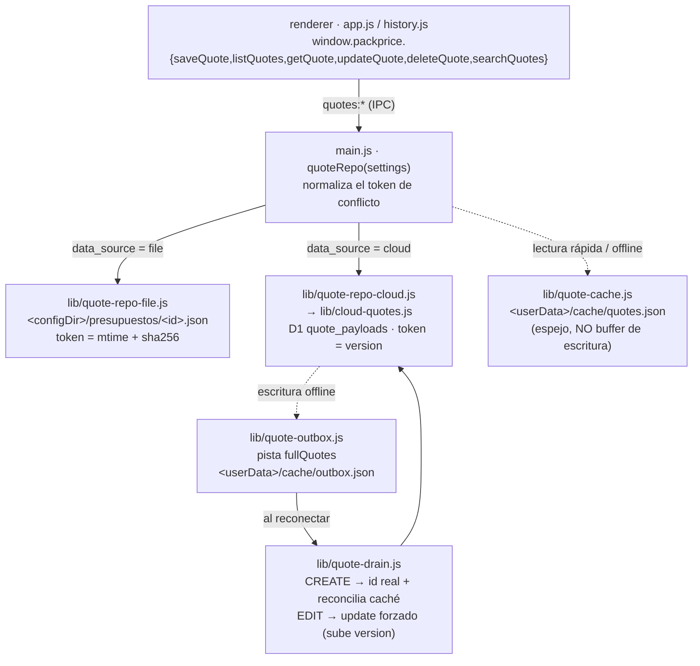

# 15 — Presupuestos compartidos (reabrir y editar entre PCs)

> **Resumen ejecutivo:** el presupuesto deja de ser una copia por PC y pasa a
> ser una **fuente de verdad compartida** detrás del mismo contrato `quotes:*`,
> con dos backends intercambiables (carpeta junto al `config.js` o tabla en la
> D1 de la empresa). Lo guardado en un PC se reabre y se edita desde otro, con
> control de conflicto y a salvo sin conexión. Al usuario no le cambia la UI
> salvo tres estados nuevos (conflicto, encolado, pendiente).

**Release:** `vX.Y.Z` (pendiente de fijar al empaquetar) · **Fecha:** 2026-06-25 ·
**Tests:** 1104 verdes · **Tamaño .exe:** pendiente de medir en el build de release

> Capturas: **pendientes** (capturar en una sesión manual con GUI — este trabajo
> se hizo en un entorno automatizado sin poder lanzar la app).

---

## Contexto

Dos problemas tenían la misma raíz: **los presupuestos vivían por PC y solo como
una foto del desglose, nunca como un registro reabrible de primera clase**
(`docs/superpowers/specs/2026-06-24-shared-quotes-reopen-edit-design.md`,
`docs/PRD.md` R12 → R12b).

1. **Bug — reabrir no se podía editar** (resuelto en la **Fase A**, ya
   integrada): al reabrir solo se renderizaba el desglose; el paso 2 nunca se
   reconstruía y el borrador guardado no almacenaba las entradas crudas (`opt`).
2. **Carencia — no se compartían entre dispositivos** (esta **Fase B**): en modo
   archivo el historial vivía en el `%APPDATA%\Quanto\presupuestos.json` de cada
   PC; en modo nube los presupuestos solo se reflejaban en D1 como filas planas
   de estadística, ni reabribles ni completas.

La Fase A dejó el modelo de datos listo (el campo `opt` y el flujo de
reabrir-para-editar). La Fase B mueve la **fuente de verdad** al almacén
compartido sin tocar el contrato que ve el renderer.

---

## Qué se hizo

En orden de lo que nota el usuario:

### 1. Un presupuesto, visible y editable desde cualquier PC

El presupuesto guardado en un PC aparece en otro (del mismo `config`) tras
refrescar el historial. Reabrir reconstruye el paso 2 editable desde `opt`
(Fase A) y, al guardar, **se actualiza el mismo presupuesto** —mismo id, sube
`version`—, nunca se crea uno nuevo. El id humano `PP-YYYY-NNNN` es canónico en
los dos modos.

### 2. Conflicto al editar (nunca pisar el cambio de otro)

Si otro equipo cambió el presupuesto mientras lo editabas, al guardar aparece un
diálogo de confirmación que reutiliza la UX de conflicto del catálogo
(`docs/UI-UX.md` §2.3b): «Otro equipo cambió este presupuesto» →
**Sobrescribir / Cancelar**. Cancelar deja todo en pantalla; sobrescribir
reintenta forzando. Nunca hay sobreescritura silenciosa (regla dura §6).

### 3. A salvo sin conexión (modo nube) y honesto en modo archivo

- **Nube:** si el backend está inalcanzable, la escritura se **encola** y se
  sincroniza al reconectar (toast «Guardado · se sincronizará al reconectar»).
  Un alta offline obtiene un id provisional `PP-PENDING-…` y queda en estado
  **pendiente** (no exportable ni editable) hasta que la cola le asigna su id
  definitivo y reconcilia la caché.
- **Archivo:** una escritura con el NAS caído **da error** y conserva los datos
  en pantalla para reintentar. El modo archivo no tiene cola: encolar en una
  pista que nada vaciaría sería un agujero negro silencioso.

### 4. Migración de los presupuestos locales previos (modo archivo)

Al arrancar, los presupuestos del antiguo `presupuestos.json` se vuelcan **una
vez**, idempotentemente, al almacén compartido (preservando su id, saltando los
ya presentes). En una corrida limpia el origen se renombra a
`presupuestos.json.bak-pre-shared` (nunca se borra).

---

## Cómo funciona

### La costura del repositorio de presupuestos

El renderer sigue llamando al mismo IPC `quotes:*`. `main.js`
`quoteRepo(settings)` elige el backend por `settings.data_source` y normaliza
los dos tokens de conflicto en uno opaco. El renderer nunca sabe dónde viven los
presupuestos (regla dura §3) — la misma costura Ports & Adapters del catálogo.



Diagrama equivalente en ASCII:

```
renderer (app.js, history.js)
        │  window.packprice.{saveQuote,listQuotes,getQuote,updateQuote,deleteQuote,searchQuotes}
        ▼
main.js  quoteRepo(settings)  ── normaliza ambos tokens en uno opaco
        ├── modo archivo → lib/quote-repo-file.js    (<configDir>/presupuestos/<id>.json · mtime+sha256)
        └── modo nube     → lib/quote-repo-cloud.js   (D1 quote_payloads vía lib/cloud-quotes.js · version)
                                   │
                       lib/quote-cache.js   (espejo por PC: lista rápida + lectura offline — NO buffer)
                       lib/quote-outbox.js  (pista fullQuotes: escrituras de nube encoladas offline)
                       lib/quote-drain.js   (puro: enruta un CREATE vs EDIT en cola al reconectar)
```

- **Fuente de verdad** = el backend compartido. **Caché** = espejo de lectura
  por PC (`<userData>/cache/quotes.json`) para listar rápido y ver lo último
  conocido sin conexión. **Outbox** = escrituras de **nube** pendientes
  (`<userData>/cache/outbox.json`, pista `fullQuotes`) que se vacían al
  reconectar para no perder nunca una escritura.

### La tabla `quote_payloads` (modo nube)

El payload reabrible completo se guarda en una **tabla nueva**
(`db/migrations/0002_quote_payloads.sql`), no en columnas nuevas de la fila plana
`quotes`:

```sql
CREATE TABLE IF NOT EXISTS quote_payloads (
  quote_id TEXT PRIMARY KEY,
  payload  TEXT NOT NULL,
  version  INTEGER NOT NULL DEFAULT 1,
  updated_at TEXT NOT NULL DEFAULT (strftime('%Y-%m-%dT%H:%M:%fZ','now'))
);
```

Una tabla aparte (en vez de `ALTER TABLE … ADD COLUMN`) es lo que mantiene la
migración **idempotente**: `CREATE TABLE IF NOT EXISTS` se re-ejecuta sin
problema, mientras que SQLite no tiene `ADD COLUMN IF NOT EXISTS` y el runner
puede re-ejecutar un archivo tras un fallo (`lib/db-migrator.js`). Se aplica bajo
el contrato existente de backup previo + verificación. La fila plana `quotes`
sigue alimentando las estadísticas y es la autoridad del estado
(pendiente/aceptado/rechazado).

### Modelo de conflicto

| Modo | Token | Detección |
|---|---|---|
| Archivo | `mtime + sha256` del `<id>.json` | re-lee y compara al guardar |
| Nube | `version` (concurrencia optimista) | `UPDATE … WHERE version = ?`; 0 filas → conflicto |

`quoteRepo.get*` devuelve un token opaco; el renderer lo devuelve tal cual al
editar. Una escritura obsoleta devuelve `{ conflict, current }` y se ofrece
Sobrescribir / Cancelar. Un cambio de estado es flujo de trabajo, no edición de
contenido: `setStatus` **no** sube la `version`.

### Comportamiento sin conexión

- **Nube:** `isBackendUnreachable(err)` distingue una caída transitoria (encolar)
  de un bug de validación/tamaño/conflicto/permiso (mostrar). Un alta offline
  recibe un id provisional `PP-PENDING-<uuid>`; el vaciado (`lib/quote-drain.js`)
  enruta cada item: un **CREATE** asigna un id real y reconcilia la caché; un
  **EDIT** va por el camino de update forzado (jamás por el `saveFullQuote`
  create-only, que haría no-op y perdería la edición). El outbox re-lee la cola
  viva en el punto de commit, así un encolado durante un `await` no se pisa.
- **Archivo:** no hay vaciado; una escritura con el NAS caído se **muestra** como
  error.

### Identificadores a prueba de colisiones entre PCs

- **Archivo:** alta con flag exclusivo `wx` + recálculo-reintento del siguiente
  `PP-YYYY-NNNN`.
- **Nube:** `nextCloudQuoteId` calcula el siguiente id y `tryClaimFullQuote` lo
  reclama con `INSERT OR IGNORE` (+ `changes`); si otro PC ganó la carrera, se
  recalcula y reintenta.

---

## Caminos descartados

- **Columnas nuevas en la fila plana `quotes`** en vez de una tabla aparte. Se
  descartó: SQLite no puede guardar `ADD COLUMN` con `IF NOT EXISTS`, y el runner
  puede re-ejecutar una migración tras un fallo. Una tabla `quote_payloads`
  separada es la única forma aditiva que el runner puede re-ejecutar sin riesgo.
- **Encolar también en modo archivo.** El NAS *es* el backend en modo archivo: no
  hay un proceso de sync que vacíe una cola, así que encolar sería un agujero
  negro silencioso. Se prefiere un error visible que conserva los datos en
  pantalla.
- **Auto-migrar a la nube los presupuestos locales previos** (ver «Decisiones
  bloqueadas»).
- **Un buffer de escritura en la caché.** La caché es solo espejo de lectura; las
  escrituras offline van por el outbox. Mezclar ambos roles invita a perder
  escrituras o servir datos rancios como si fueran la verdad.

---

## Decisiones bloqueadas

- **Decisión:** **en modo nube NO se auto-migran** los presupuestos locales
  previos a la Fase B. **Por qué:** los presupuestos locales antiguos llevan la
  forma `buildQuoteDraft` (user/customer/result/totals/opt/…) pero **no** los
  campos planos de estadística que el backend de nube exige (ts, tier,
  total_units, total_vat_inc, sale_base, margin_pct, catalog_version); un
  backfill correcto necesita derivar el tramo (dependiente del catálogo),
  puentear ids contra las filas planas UUID anteriores y de-duplicar
  estadísticas. El archivo local se **conserva intacto** y el salto se registra
  en el log. **Reabrir solo si:** un cliente real necesita arrastrar su historial
  local previo a la nube (entonces se hace el backfill con id-bridging + dedup).
- **Decisión:** en modo archivo, una escritura con el NAS caído **da error**, no
  encola. **Por qué:** el modo archivo no tiene proceso de vaciado. **Reabrir
  solo si:** alguna vez el modo archivo gana un sync en segundo plano.
- **Pendiente de limpieza:** los canales de preload `uploadQuote` / `setQuoteStatus`
  quedan sin uso (muertos) en el renderer tras esta fase; se retiran en una
  limpieza posterior.
- **At-least-once en el vaciado de CREATEs offline (nube):** si el proceso muere
  tras confirmar el `createQuote` en D1 pero antes de eliminar la entrada del
  outbox, el siguiente vaciado crea un presupuesto duplicado —nunca uno
  perdido—. Es una propiedad inherente de una cola local sin Worker; el vaciado
  de EDITs no lo tiene (actualización idempotente sobre un id estable).

---

## Smoke checklist (a ejecutar por el mantenedor antes de distribuir un build)

> No ejecutado aquí: el entorno automatizado no puede lanzar la GUI de Electron.
> Estas comprobaciones se hacen **manualmente, con dos instancias apuntando al
> mismo config**, antes de empaquetar.

**Modo archivo (dos PCs / dos instancias sobre el mismo `config.js`):**
- [ ] Guardar en A → aparece en B tras refrescar el historial.
- [ ] Editar en B → A ve el cambio tras refrescar.
- [ ] Borrar en A → desaparece en B.
- [ ] Provocar una edición obsoleta (cambiar el archivo a mano mientras A edita)
      → diálogo de conflicto Sobrescribir/Cancelar.

**Modo nube (mismo D1 de la empresa):**
- [ ] Las mismas cuatro de arriba.
- [ ] Guardar sin conexión → toast «se sincronizará al reconectar» → se vacía al
      reconectar.
- [ ] Un alta offline muestra estado **pendiente** (`PP-PENDING-…`, no
      exportable/editable) y obtiene su id real al reconectar.

**Ruta de actualización (modo archivo):**
- [ ] Un PC con un `presupuestos.json` previo arranca → sus presupuestos
      aparecen en el almacén compartido **una vez**; existe
      `presupuestos.json.bak-pre-shared`.
- [ ] Modo nube: los presupuestos locales previos **no** se auto-migran
      (documentado) y el archivo local queda intacto.

---

## Métricas de la release

| Métrica | Antes (Fase A) | Después (Fase B) |
|---|---|---|
| Fuente de verdad de presupuestos | per-PC `presupuestos.json` | almacén **compartido** (archivo o D1) |
| Tests | — | **1104** verdes (55 archivos) |
| Módulos `lib/` nuevos | — | `quote-repo-file`, `quote-repo-cloud`, `quote-cache`, `quote-drain`, `quote-migrate-local`, `quote-store-helpers` (+ `cloud-quotes` y `quote-outbox` ampliados) |
| Migraciones SQL empaquetadas | `0001_init.sql` | + `0002_quote_payloads.sql` (aditiva, idempotente) |
| Dependencias nuevas | — | **0** (`fs`/`fetch`/`crypto` nativos) |
| Tamaño del `.exe` | — | pendiente de medir |

---

*Checklist antes de publicar: resumen de 3 líneas ✓ · capturas con datos de demo
— **pendientes de capturar en sesión manual con GUI** ⏳ · enlazado desde
`devlog/README.md` — **pendiente** (lo añade el mantenedor al consolidar el
índice del devlog) ⏳ · smoke de dos instancias ejecutado por el mantenedor —
**pendiente** ⏳ · publicar **antes** de distribuir el `.exe` ✓*
