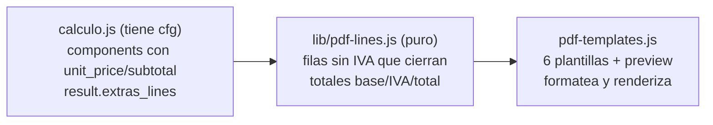

# 16 — El PDF que un cliente puede comprobar: desglose sin IVA (v5.1.0-beta)

> **Resumen ejecutivo:** el presupuesto en PDF pasa de "una línea por pack y
> PVP con IVA" a un **desglose real**: cada prenda en su línea (también dentro
> de un pack bundle), cada complemento en la suya, precios unitarios **sin
> IVA** que cierran (`cantidad × unitario = subtotal`, al céntimo) y un bloque
> de totales Subtotal (sin IVA) · IVA · Total (IVA incl.). Es el formato que un
> cliente de taller puede repasar con una calculadora en la mano.

**Release:** `v5.1.0-beta` · **Fecha:** 2026-07-07 · **Tests:** 1143 verdes ·
**Tamaño .exe:** pendiente de medir en el build de release

> Nota de release: la `v5.1.0-beta` publicada empaqueta los capítulos **14**
> (marca + instalador + auto-update), **15** (presupuestos compartidos) y este
> **16**. Capturas: **pendientes** (sesión manual con GUI y datos demo).

---

## Contexto

Petición directa del dueño tras usar los PDF con clientes reales. El formato
anterior tenía cuatro problemas y un bug escondido:

1. **El pack bundle era una caja negra:** "Pack Peña × 12 — 311,40 €". El
   cliente no veía qué parte era camiseta y qué parte sudadera.
2. **Los extras salían colapsados** en una sola línea "Extras opcionales (sin
   IVA)", sin detalle ni cantidades.
3. **Los precios de línea eran PVP con IVA**, pero un presupuesto profesional
   se desglosa en neto por línea + IVA al pie.
4. **El "precio medio por persona" no significaba nada** en un pedido (no se
   conoce el nº de personas), y ocupaba una línea destacada.
5. **Bug latente:** la tabla leía `line.price` pero el motor emite
   `line.unit_price` — en producción la columna de precio unitario de los packs
   por componentes renderizaba "—". El fixture de tests usaba `price:` y lo
   enmascaraba.

Diseño aprobado y detallado en
`docs/superpowers/specs/2026-07-01-pdf-desglose-sin-iva-design.md` (revisado
2026-07-06); plan de implementación en
`docs/superpowers/plans/2026-07-01-pdf-desglose-sin-iva.md`.

---

## Qué se hizo

En orden de lo que nota el usuario (y su cliente):

### 1. Cada artículo en su línea, también dentro de un bundle

Un pack bundle ("Pack Peña" a precio cerrado por pack) ahora **lista cada
prenda como línea propia** — Camiseta DTF y Sudadera DTF con su cantidad, su
unitario y su subtotal — repartiendo el precio del pack entre componentes de
forma que **las líneas suman exactamente el total del pack** (reparto
proporcional + ajuste por resto mayor, sin céntimos perdidos). El peso del
reparto usa **una sola base por bundle**: el precio de catálogo individual de
cada prenda cuando todas lo tienen; si no, el coste interno de todas; y como
último recurso, reparto igualitario. Nunca se mezclan escalas.

<!-- TODO captura: PDF exportado de un Pack Peña con 2 líneas de prenda + extras (datos demo) -->

### 2. Extras línea a línea

Cada complemento seleccionado sale como línea propia (concepto, cantidad,
unitario, subtotal) en vez de una única línea colapsada. El motor guarda ahora
`result.extras_lines` con los hechos de precio (nombre, cantidad, precio, si
llevaba IVA incluido) en el momento de calcular.

### 3. Precios sin IVA que cierran al céntimo

La columna de precio pasa a **neto (sin IVA)** y el pie a **Subtotal (sin
IVA) · IVA · Total (IVA incl.)**. La regla de redondeo elegida hace que **cada
fila impresa cierre**: se redondea primero el unitario sin IVA y el subtotal es
exactamente `cantidad × unitario`; la línea de IVA del pie absorbe la deriva de
redondeo (céntimos) para que el bloque siempre sume el total cobrado. **Lo que
paga el cliente no cambia en ningún caso** — solo cambia cómo se presenta.

### 4. Fuera el "precio medio por persona"

Desaparece de las 6 plantillas integradas. El dato seguía calculándose sobre
supuestos que un pedido real no cumple.

### 5. Alcance: 6 plantillas + preview, con degradado elegante

Clásica, Moderna, Compacta, Detallada, Corporativa y Formulario, más la
vista previa de ajustes (su presupuesto demo ejercita bundle + extras +
recargo de tallas). Los **presupuestos ya guardados** (sin los campos nuevos)
degradan con elegancia: el bundle vuelve a una línea única y los extras a la
línea colapsada — nunca se inventan precios que el motor no almacenó.

---

## Cómo funciona

La clave es **quién sabe qué**. Los hechos de precio (precio de catálogo de
cada prenda, etiquetas y precios de los addons) necesitan `cfg`, así que se
capturan en `renderer/calculo.js` al calcular y viajan **dentro del
presupuesto guardado** (el presupuesto se autodescribe). La aritmética de
presentación (pasar a sin-IVA, cerrar filas) solo necesita ese `result`
guardado, así que vive en un módulo nuevo **puro y sin `cfg`**:
`lib/pdf-lines.js` (`buildPdfLines(result)`), que incluso deriva el tipo de
IVA del propio presupuesto (`vat / sale_base`) — un presupuesto antiguo se
imprime coherente aunque el IVA del config haya cambiado después.

Ejemplo real (Pack Peña, 12 packs a 25,95 € con IVA):

- Reparto del bundle: Camiseta 138,60 € · Sudadera 172,80 € (suman 311,40 € exacto).
- Sin IVA (21%): Camiseta 9,55 €/ud → 114,60 € · Sudadera 11,90 €/ud → 142,80 €.
- Pie: Subtotal 257,40 € · IVA 54,00 € (absorbe 4 céntimos de deriva) · Total 311,40 €.

---

## Caminos descartados

- **Reconciliar las filas contra el `sale_base` guardado** (el diseño
  original). Estiraba los subtotales de línea para que sumaran la base
  almacenada, y eso hacía visible `cantidad × unitario ≠ subtotal` en filas de
  cara al cliente — justo lo que un cliente comprueba. Se sustituyó por "cada
  fila cierra y la línea de IVA absorbe la deriva". Un presupuesto guardado
  incoherente muestra sus números reales (y una línea de IVA rara) en vez de
  precios plausibles inventados.
- **Mezclar bases de reparto dentro de un bundle** (precio de catálogo para las
  prendas que lo tienen, coste interno para las que no). Mezcla escalas
  distintas en el mismo reparto y sesga los pesos; se eligió una única base por
  bundle con cascada de fallbacks.
- **Pasar `cfg` a `pdf-templates.js`** para leer IVA y etiquetas al renderizar.
  Rompía el patrón de presupuesto autodescriptivo (un PDF de un presupuesto de
  2026 debe imprimirse igual aunque el catálogo haya cambiado) y acoplaba la
  capa de presentación al config.
- **Línea de "descuento de pack"** (mostrar el precio individual y un descuento
  explícito). Fuera de alcance: inventa un precio de referencia que el motor no
  usa y complica el reparto sin que nadie lo pidiera.

## Decisiones bloqueadas

- **Decisión:** el presupuesto guardado es **autodescriptivo**: los hechos de
  precio se capturan al calcular (en `result`) y la presentación no consulta el
  config. **Por qué:** un presupuesto histórico debe reimprimirse fiel aunque
  el catálogo cambie. **Reabrir solo si:** el presupuesto necesitara datos que
  no quepan razonablemente en `result`.
- **Decisión:** filas que cierran + IVA absorbe la deriva (nunca estirar
  precios de línea). **Por qué:** el PDF lo comprueba un cliente con
  calculadora; `qty × unit = subtotal` es innegociable. **Reabrir solo si:**
  se exigiera cuadrar la base contable por línea (factura formal, no
  presupuesto).
- **Decisión:** las **claves** del contexto legacy (`per_person`,
  `has_per_person`, `extras_line`, `has_extras`, `items[]`) sobreviven para
  las plantillas custom de la nube, pero tres **semánticas cambian** (unitario
  y subtotal ahora sin IVA; recargo y extras derivan de las mismas filas que la
  tabla). Aceptado en beta: no hay plantillas custom en producción.
  **Reabrir solo si:** una plantilla custom real se rompa — entonces se
  versiona el contexto.
- **Decisión:** sin cambio de esquema persistido (los campos nuevos viven en el
  `result` del presupuesto) → **sin migración**. **Por qué:** additivo y
  retrocompatible; los presupuestos viejos degradan con elegancia.

## Métricas de la release

| Métrica | Antes (cap. 15) | Después (cap. 16) |
|---|---|---|
| Tests | 1104 verdes | **1143 verdes** (56 ficheros) |
| Líneas del PDF (bundle + 2 extras) | 2 (pack + extras colapsados) | **5** (2 prendas + 2 extras + recargo si aplica) |
| Precios de línea | PVP con IVA (y "—" por el bug `line.price`) | **sin IVA, cierran al céntimo** |
| "Precio por persona" | línea destacada | **eliminado** |
| Módulos en `lib/` | — | **+1** (`pdf-lines.js`, puro y testeado) |
| Dependencias nuevas | 0 | **0** |

---

*Checklist antes de publicar: resumen de 3 líneas ✓ · capturas con datos de demo
(pendientes — marcadas `TODO captura`) · enlazado desde `devlog/README.md` ✓ ·
publicado **antes** de distribuir el `.exe` (pendiente del build de release).*
