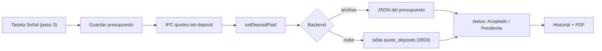

# 18 — Señal (anticipo) del pedido (v5.2.0-beta)

> **Resumen ejecutivo:** el taller pide una señal mínima (40 % del total con
> IVA, redondeada al euro hacia arriba) antes de lanzar un pedido; la app ya
> la calcula, deja marcarla como pagada —el presupuesto pasa a Aceptado—
> desde el paso 3 o desde el historial, y la imprime en el PDF. Además, las
> bases de datos en la nube ya existentes migran su esquema solas al cargar
> el catálogo, sin esperar a una reprovisión.

**Release:** `v5.2.0-beta` · **Fecha:** 2026-09-07 · **Tests:** 1249 verdes ·
**Tamaño .exe:** ~75 MB (pendiente de medir)

---

## Contexto

Hasta ahora la señal se calculaba a mano —"multiplica por 0,4 y redondea"—,
no quedaba registrada en ningún sitio y no aparecía en el PDF: el mostrador
tenía que anotarla aparte y confiar en la memoria para saber si ya se había
cobrado. El paso 3 del flujo tenía además una tarjeta "Próximos pasos"
—con un botón "Enviar al cliente · Por email o WhatsApp" deshabilitado—
que no llegó a implementarse y ocupaba justo el hueco donde tenía sentido
poner esto.

## Qué se hizo

- **Tarjeta "Señal" en el paso 3**, en el hueco que dejó "Próximos pasos":
  porcentaje editable por presupuesto (recalcula el mínimo al vuelo), señal
  mínima en euros enteros, casilla "Señal pagada" que revela el importe
  recibido. El 0 % es válido y se lee como "sin señal mínima" para ese
  presupuesto.

  TODO captura: tarjeta "Señal" en el paso 3, sin marcar y marcada como
  pagada.

- **Columna de señal en el historial**: chip verde "Señal · Y €" cuando está
  pagada, botón "Marcar señal" con formulario en línea (sin modal) cuando no
  lo está; ambas acciones con deshacer vía el toast existente. Las filas de
  un presupuesto todavía sin subir (`PP-PENDING-…`) muestran el botón
  deshabilitado, igual que ya pasaba con la exportación a PDF.

  TODO captura: columna de señal en el historial —chip pagado y formulario
  "Marcar señal" en línea.

- **Filas de señal en el PDF** y variantes del texto de confirmación en las
  seis plantillas integradas: señal mínima siempre que el presupuesto la
  lleve; recibida, fecha y resto pendiente cuando está pagada.

  TODO captura: PDF con las filas de señal mínima / recibida / resto
  pendiente.

- **"Copiar resumen"** incorpora la línea de señal mínima y, si está pagada,
  la de señal recibida con fecha.

- **Porcentaje por defecto en config** (`quote_settings.deposit_pct`, 0,4):
  vive en `config.js`, sin editor de admin ni de asistente —se decidió así,
  ver más abajo—; en el paso 3 solo hay override por presupuesto.

- **Migraciones pendientes al cargar la nube**: además de en la
  reprovisión, ahora se aplican también en cada carga normal del catálogo
  cloud, así que una base de datos de cliente ya existente se pone al día
  sola en el primer arranque tras la actualización.

## Cómo funciona

El dato tiene dos mitades con reglas distintas:

- **`deposit`** (contenido): `{ pct, min_amount }`, forma parte del borrador
  del presupuesto y se recalcula en cada edición a partir del total y el
  porcentaje vigente —igual que `totals`—.
- **`deposit_paid`** (flujo): `{ amount, at, by }` o ausente, escrito
  **solo** por la operación `quotes:set-deposit` → `setDepositPaid(id, paid,
  { now })`. Nunca sube el `version` del contenido —es un hecho de flujo,
  como `status`— y en el mismo golpe fija `status: 'accepted'` (pagada) o
  `'pending'` (anulada) con su `status_ts`.

Los dos backends implementan el mismo contrato:

- **Archivo** (`lib/quote-repo-file.js`): `deposit` y `deposit_paid` son
  claves más dentro de `<configDir>/presupuestos/<id>.json`, con la
  escritura atómica de siempre.
- **Nube** (`lib/quote-repo-cloud.js` + `lib/cloud-quotes.js`): `deposit`
  sigue dentro del payload JSON (contenido); `deposit_paid` vive en su
  propia tabla aditiva `quote_deposits` (migración `0003`), con un
  `LEFT JOIN` en `getFullQuote`/`listFullQuotes` que siempre gana sobre
  cualquier copia obsoleta que pudiera quedar dentro del payload.

**El matiz del token en modo archivo.** El token de conflicto ahí es un hash
del contenido, así que una señal marcada desde otro PC lo mueve: el próximo
guardado de un editor abierto en ese mismo presupuesto muestra el diálogo de
conflicto habitual —seguro, no es un bug, y "Sobrescribir" conserva la señal
ya marcada. Como una señal marcada desde el propio PC mueve igual el hash, la
respuesta de `quotes:set-deposit` devuelve un token fresco para que ese mismo
editor no choque consigo mismo en el siguiente guardado.

**Regla offline.** Marcar la señal **no** se encola en el outbox: si el
backend no responde, la respuesta es `{ ok:false, offline:true }`, el
renderer muestra el aviso de sin conexión y la marca se rehace desde el
historial al volver la conexión —nunca se pierde en silencio, pero tampoco
se finge hecha. Al revés, una edición del presupuesto que sí se encola
(nube, sin conexión) no toca `deposit_paid`: la señal ya cobrada se
mantiene tal cual estaba.

**El porcentaje por defecto** (`DEFAULT_DEPOSIT_PCT = 0.4`,
`config.default.js`) se aplica **en memoria**, en los dos puntos donde el
catálogo cruza hacia el renderer —`config:read` en modo archivo,
`toValidatedConfig` en `lib/cloud-bootstrap.js` para la nube—, nunca
reescribiendo `config.js` ni las tablas en el arranque. Un catálogo antiguo
que no tenía el campo lo recibe así hasta el próximo guardado real de
"Empresa" desde el editor, que ya lo persiste.

## Caminos descartados

- **La señal dentro del contenido, con subida de `version`.** Marcarla desde
  el historial habría sido "reabrir, parchear, reemplazar": cada clic del
  mostrador podría chocar con un editor abierto en otro PC ("Otro equipo
  cambió este presupuesto") y el cambio de estado seguiría necesitando su
  propia escritura. Dos escrituras y peor experiencia para el caso más
  frecuente. Descartado.
- **Un estado nuevo `accepted_paid`.** Rompe el `CHECK` de `quotes.status`
  (no es aditivo), y con él las estadísticas y los chips existentes.
  Descartado.
- **Encolar la marca en el outbox offline.** Un aviso claro ("vuelve a
  intentarlo al reconectar") es más honesto que fingir que la señal quedó
  registrada; encolarla además complicaría el token de conflicto sin
  necesidad real —el mostrador ya está delante del cliente cuando marca.
  Descartado.
- **Editor de admin o del asistente para el porcentaje.** Es un dato de
  negocio que casi no cambia; un editor dedicado para eso es
  sobreingeniería frente al override por presupuesto que ya cubre el caso
  excepcional. Descartado.
- **Campo de método de pago.** Fuera de alcance explícito de esta iteración;
  se registra importe, fecha y quién la marcó, nada más.
- **KPI de señales en Estadísticas.** Fuera de alcance explícito; puede
  añadirse después sin tocar el modelo de datos actual.

## Decisiones bloqueadas

- **Decisión:** el mínimo es el 40 % del total con IVA, redondeado a
  céntimos y después hacia **arriba** al euro. **Por qué:** es un mínimo, no
  puede quedar nunca por debajo del porcentaje pactado; redondear a
  céntimos primero evita que un artefacto de coma flotante (p. ej.
  `400.00000000000006`) empuje el euro hacia arriba de más. **Reabrir solo
  si:** el taller cambia su política de anticipos.
- **Decisión:** señal pagada → estado Aceptado; señal anulada → Pendiente;
  los chips de estado quedan libres del todo (se permite marcar Rechazado
  con la señal todavía cobrada). **Por qué:** cancelar un pedido no borra el
  dinero ya recibido; forzar los estados a ir de la mano habría impedido
  representar una cancelación con señal retenida. **Reabrir solo si:**
  aparece un flujo de devolución que necesite distinguirse del simple
  rechazo.
- **Decisión:** el porcentaje por defecto vive solo en config
  (`quote_settings.deposit_pct`); el paso 3 solo permite un override por
  presupuesto, sin editor de admin/asistente. **Por qué:** ningún número de
  negocio en el código (regla dura §2 de `CLAUDE.md`), y el override por
  presupuesto ya cubre el caso en que un pedido concreto necesita otro
  porcentaje. **Reabrir solo si:** el taller empieza a cambiarlo con
  frecuencia suficiente para justificar un editor.
- **Decisión:** `DEFAULT_DEPOSIT_PCT` (`config.default.js`) es el único
  hogar del 40 % por defecto; nada de ese número vive repetido en el
  renderer, el PDF o los backends. **Por qué:** regla dura §2 —ningún número
  de negocio en el código. **Reabrir solo si:** nunca; es una regla dura.

## Métricas de la release

| Métrica | Antes | Después |
|---|---|---|
| Tests | 1143 | 1249 |
| Tamaño del `.exe` | 75,4 MB | pendiente de medir |
| Migraciones SQL (`db/migrations/`) | `0002` | `0003` |

---

*Checklist antes de publicar: resumen de 3 líneas ✓ · capturas con datos de
demo (nunca precios reales del taller) — **pendientes**, ver los
`TODO captura` de arriba · enlazado desde `devlog/README.md` ✓ · publicado
**antes** de distribuir el `.exe` (pendiente de completar capturas).*
