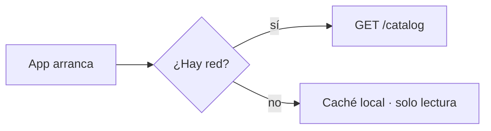

# NN — Título del capítulo (vN.N.N)

> **Resumen ejecutivo (3 líneas máx):** qué cambió en esta release, por qué
> ahora, y qué nota el usuario al abrir la app.

**Release:** `vN.N.N` · **Fecha:** AAAA-MM-DD · **Tests:** NNN verdes ·
**Tamaño .exe:** NN MB

---

## Contexto

Qué problema o necesidad disparó este trabajo. Enlaza al requisito del PRD
(`docs/PRD.md` §…) o al plan correspondiente si existe.

## Qué se hizo

Lo entregado, en orden de importancia para el usuario. Una captura por cambio
visible:

> Capturas en `devlog/images/`, prefijadas con el número de capítulo
> (`13-indicador-datos.png`). PNG para UI; ancho ~1200 px; recorta al área
> relevante.

## Cómo funciona

Solo si hay diseño técnico que merezca explicación. Diagramas en Mermaid para
que vivan en el markdown sin herramientas externas:

## Caminos descartados

Las alternativas consideradas y por qué se descartaron. Esta sección es la que
da valor al devlog dentro de seis meses — no la dejes vacía si hubo debate.

## Decisiones bloqueadas

- **Decisión:** … **Por qué:** … **Reabrir solo si:** …

## Métricas de la release

| Métrica | Antes | Después |
|---|---|---|
| Tests | | |
| Tamaño del `.exe` | | |
| (la que aplique) | | |

---

*Checklist antes de publicar: resumen de 3 líneas ✓ · capturas con los datos
de demo (nunca precios reales del taller) ✓ · enlazado desde
`devlog/README.md` ✓ · publicado **antes** de distribuir el `.exe` ✓*
